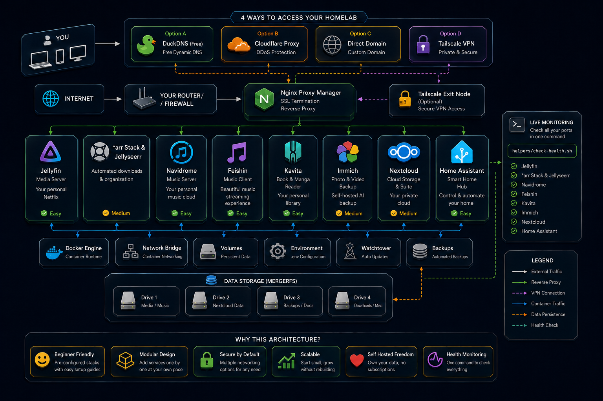

# 🏠 Homelabbing

Welcome to **Homelabbing** — a practical, concept-driven guide designed to help you build, understand, and own your digital life on your very first home server.

If you have ever felt frustrated by rising monthly subscription fees, privacy-invading cloud services, or having your personal files locked inside corporate servers, you are in the right place. We believe that taking back control of your data shouldn't require a computer science degree or running mysterious, blind automation scripts you don't understand. 

Here, **you learn the architecture first, understand what every command does, and build your lab piece by piece.**

---

## 🌟 What You Will Be Able to Build (Day-to-Day Media/NAS Hybrid)

By following our modular guides, you can turn an affordable refurbished PC into a private, high-performance cloud capable of replacing major subscription services:

| What You Get | Commercial Equivalent | The Self-Hosted Stack |
| :--- | :--- | :--- |
| **🎬 4K Media Streaming** | Netflix, Disney+ | [Jellyfin + *arr Pipeline](stacks/media-server/) |
| **🎵 Music Streaming** | Spotify, Apple Music | [Navidrome](stacks/music-server/) |
| **📸 Photo Backup & Sync** | Google Photos, iCloud | [Immich](stacks/photo-backup/) |
| **📚 eBook & Manga Reader** | Kindle, Comixology | [Kavita](stacks/book-reader/) |
| **☁️ Cloud Storage & Sync** | Google Drive, Dropbox | [Nextcloud](stacks/cloud-storage/) |
| **🏠 Smart Home Automation** | SmartThings, Apple Home | [Home Assistant](stacks/home-automation/) |
| **🛡️ Network Ad Blocking** | AdGuard DNS Pro | [AdGuard Home](stacks/home-automation/) |

---

## 🗺️ Your Learning Path

We structured this repository so you can start from absolute zero and grow into a confident server owner. Follow our foundational guides in order:

1. **[01. What is Self-Hosting?](docs/01-what-is-selfhosting.md)** — Understand the philosophy, privacy benefits, and true cost comparison of running your own server.
2. **[02. Understanding Docker & Containers](docs/02-understanding-docker.md)** — Learn how containerization works, why we use `docker compose`, and how to manage services safely.
3. **[03. Your First Home Server](docs/03-your-first-server.md)** — Pick hardware on any budget, install Ubuntu Server, set up SSH, and install Docker Engine step by step.
4. **[04. Storage, Disks & NAS Concepts](docs/04-storage-and-nas.md)** — Master disk mounting, `lsblk`, `/etc/fstab`, and pooling drives with `mergerfs` into a unified `/data` pool.
5. **[05. Networking, DNS & Reverse Proxies](docs/05-networking-concepts.md)** — Understand ports, DNS, SSL/TLS padlocks, and how to safely access your services remotely using DuckDNS, Cloudflare, or Tailscale.
6. **[06. Backups & Data Redundancy](docs/06-backups-and-redundancy.md)** — Learn how to separate configuration state from bulk media, encrypt your snapshots, and protect against hardware failures.
7. **[07. Security & Hardening Basics](docs/07-security-basics.md)** — Master UFW firewalls, zero-trust network isolation, and essential best practices like never hardcoding secrets.
8. **[08. Home Automation & Ad Blocking](docs/08-home-automation-and-ad-blocking.md)** — Master local smart home IoT sovereignty with Home Assistant and network-wide DNS ad/tracker blocking with AdGuard Home.

---

## 🗂️ How This Repository Is Organized

- **[`docs/`](docs/)** — Concept-driven learning guides explaining the *why* and *how* behind home server administration (`01` through `08`).
- **[`stacks/`](stacks/)** — Modular, self-contained Docker Compose stacks (`media-server`, `arr-stack`, `music-server`, `photo-backup`, `book-reader`, `cloud-storage`, `home-automation`, `networking`, `full-stack`). Every single line in every compose file is heavily commented to explain what it does.
- **[`helpers/`](helpers/)** — Diagnostic and utility scripts (like `check-health.sh`) to help you troubleshoot and verify your environment.
- **[`reference/`](reference/)** — *For advanced reference and inspiration only:* Contains the author's personal 25+ service production setup and recovery workflows. You are not expected to deploy this directly!

---

## 🌐 Explore the Live Interactive Guide & Community

Prefer browsing online? Visit our companion website for interactive tools, architecture diagrams, decision flowcharts, and visual walkthroughs:

👉 **[Visit the Homelabbing Website](https://Zamiul-rashid.github.io/Homelabbing/)**

Want to discover more self-hosted community services and products? Check out the Awesome-Homelab community directory:

👉 **[Explore Awesome-Homelab](https://www.awesome-homelab.com/)**

---

## 🤝 Philosophy: Understand the Architecture First, Then Implement

Unlike many repositories that give you a single "magic script" that hides what happens under the hood, **Homelabbing** avoids blind automation. Why? Because when you are self-hosting on your own and your server encounters an issue at 2:00 AM, copying and pasting commands or running a magic script without understanding the underlying mechanics will leave you stuck and helpless.

First learn how ports, container networks, volume bind mounts (`/config` vs `/data`), and reverse proxies work. Once you understand the architecture, implementation becomes straightforward—and you will be able to troubleshoot independently, customize your setup with confidence, and truly own your digital infrastructure!
