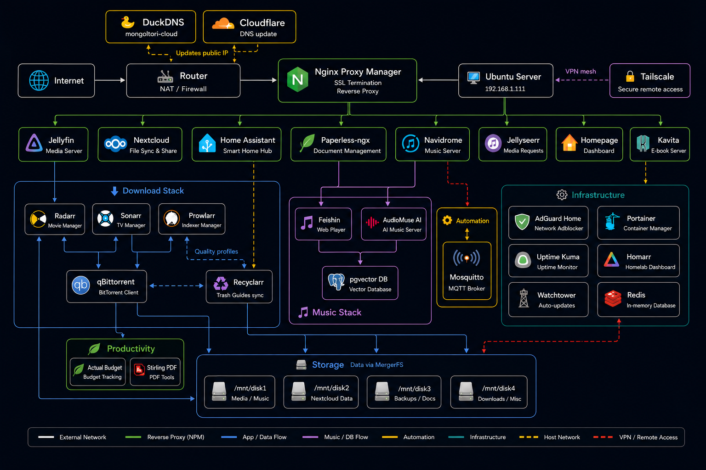

# 🏠 Homelab

> **🌟 LIVE INTERACTIVE SHOWCASE WEBSITE:** [https://Zamiul-rashid.github.io/Homelabbing](https://Zamiul-rashid.github.io/Homelabbing)  
> Explore modular setup guides, interactive networking decision wizards, and live port reference health tools!

> **🚀 NEW TO HOMELABBING?** Check out our [Beginner Quickstart Guide](./quickstart/README.md) (`quickstart/`) to launch modular stacks (Jellyfin, *arr, Navidrome, Immich, Nextcloud) right away!

> A fully self-hosted home server stack running on a single Ubuntu machine with Docker. 25+ services. Automated backups. SSL termination. AI features. Recoverable from scratch in under 30 minutes.

[](https://Zamiul-rashid.github.io/Homelabbing)
[](https://www.docker.com/)
[](https://ubuntu.com/)
[](WHY-SELFHOST.md)
[](LICENSE)



---

## 📖 Table of Contents

1. [Why Self-Host?](#1-why-self-host)
2. [What You Get (Services Overview)](#2-what-you-get-services-overview)
3. [Stack Overview](#3-stack-overview)
4. [Network Architecture](#4-network-architecture)
5. [Hardware Requirements](#5-hardware-requirements)
6. [Quick Start](#6-quick-start)
7. [Doomsday Protocol (10-Step Recovery)](#7-doomsday-protocol-10-step-recovery)
8. [Backup Strategy](#8-backup-strategy)
9. [Security Posture](#9-security-posture)
10. [Maintenance](#10-maintenance)
11. [Contributing & License](#11-contributing--license)

---

## 1. Why Self-Host?

In an era of subscription fatigue, escalating cloud costs, and eroding digital privacy, building your own home infrastructure is one of the most rewarding decisions you can make. This repository demonstrates how a single, energy-efficient server can replace thousands of dollars a year in proprietary subscriptions while granting you absolute dominion over your digital life.

- 🔒 **Privacy First** — Your personal documents, family photos, financial budgets, and media listening habits stay strictly on physical disks inside your home. No telemetries, no cloud scans, and no third-party data mining.
- 💸 **Dramatic Cost Savings** — Eliminate recurring subscriptions for Netflix, Spotify, iCloud/Google One, Dropbox, Adobe Acrobat, UptimeWeb, and personal finance web apps. A modest $150–$300 hardware investment breaks even in months.
- ⚡ **Unrivaled Local Speed** — Experience instant, uncompressed 4K HDR video streaming across your local gigabit network at bitrates (50–100+ Mbps) that commercial cloud streaming platforms simply cannot deliver without buffering or compression artifacts.
- 🎛️ **Absolute Control** — No arbitrary UI redesigns, feature deprecations, or sudden price hikes. You dictate when software updates happen, what features are enabled, and exactly how data is organized and backed up.
- 🧠 **Practical DevOps Mastery** — Master enterprise-grade technologies right in your living room: Linux system administration, Docker containerization, reverse proxies, Let's Encrypt SSL automation, database management, network isolation, and disaster recovery.
- 🛡️ **Zero-Trust Resilience** — Built from the ground up to survive hardware failures. Armed with automated AES-256-CBC encrypted backups and our **[Doomsday Protocol](#7-doomsday-protocol-10-step-recovery)**, you can resurrect the entire 25+ service stack on bare metal in under 30 minutes without relying on memory.
- 🧩 **Limitless Extensibility** — Modular architecture separated across clean Docker networks. Adding a new self-hosted app takes exactly one `docker-compose.yml` block and zero configuration headaches.

📖 **Read the comprehensive guide:** **[WHY-SELFHOST.md](WHY-SELFHOST.md)** for detailed TCO breakdown and philosophy.

---

## 2. What You Get (Services Overview)

Our lab runs **25+ meticulously curated, production-ready services**, integrated cleanly across isolated networks with automatic healthchecks and resource limits.

### 🎬 Media & Entertainment
| Service | Port | What It Does | Why You Want It |
|---|---|---|---|
| **[Jellyfin](https://jellyfin.org/)** | `8096` | Complete media server | Stream 4K movies, TV shows, and live TV to any device without licensing fees or transcoding limits. |
| **[Navidrome](https://www.navidrome.org/)** | `4533` | Subsonic music server | Lightweight, blazing-fast personal music server compatible with hundreds of mobile/desktop Subsonic apps. |
| **[Feishin](https://github.com/jeffvli/feishin)** | `9180` | Modern music web client | Sleek, desktop-grade web application for Navidrome with rich library management and lyrics support. |
| **[Kavita](https://www.kavitareader.com/)** | `5050` | Books & Manga reader | Fast, responsive server for reading eBooks (EPUB/PDF), comics (CBZ/CBR), and manga anywhere. |
| **[Radarr](https://radarr.video/)** | `7878` | Movie collection manager | Automatically monitors, searches, and upgrades your movie collection to TRaSH Guides quality standards. |
| **[Sonarr](https://sonarr.tv/)** | `8989` | TV series manager | Tracks episodic television schedules, downloads new episodes automatically, and maintains metadata. |
| **[Prowlarr](https://prowlarr.com/)** | `9696` | Indexer manager | Centralized indexer management that syncs feeds effortlessly to both Radarr and Sonarr. |
| **[Jellyseerr](https://github.com/Fallenbagel/jellyseerr)** | `5055` | Media request portal | Beautiful discovery and request UI allowing household users to request movies/shows right into Radarr/Sonarr. |
| **[qBittorrent](https://www.qbittorrent.org/)** | `8080` | BitTorrent client | Reliable, automated download client wired directly into your storage pool and *arr pipeline. |
| **[Recyclarr](https://recyclarr.dev/)** | CLI | TRaSH Guides auto-sync | Command-line tool that automatically synchronizes TRaSH Guides custom formats and quality profiles. |

### 🏠 Home Automation & IoT
| Service | Port | What It Does | Why You Want It |
|---|---|---|---|
| **[Home Assistant](https://www.home-assistant.io/)** | `host` | Smart home central hub | The world's leading open-source home automation platform. Unifies thousands of smart devices locally. |
| **[Mosquitto](https://mosquitto.org/)** | `1883` | MQTT message broker | Lightweight, rock-solid messaging backbone enabling real-time IoT sensors and Zigbee/Z-Wave integrations. |

### ☁️ Cloud Storage & Productivity
| Service | Port | What It Does | Why You Want It |
|---|---|---|---|
| **[Nextcloud](https://nextcloud.com/)** | `4443` | Self-hosted cloud suite | Your private replacement for Google Drive/iCloud. File synchronization, contacts, calendars, and sharing. |
| **[Paperless-ngx](https://docs.paperless-ngx.com/)** | `8010` | Intelligent document archive | OCR-powered, searchable document management system that transforms messy paper stacks into organized PDFs. |
| **[Stirling PDF](https://github.com/Stirling-Tools/Stirling-PDF)** | `18888` | All-in-one PDF utility suite | Merge, split, compress, OCR, watermark, and convert PDFs locally without uploading files to shady online tools. |
| **[Actual Budget](https://actualbudget.org/)** | `5006` | Personal finance tracker | Privacy-focused envelope budgeting system with multi-device sync and end-to-end encryption support. |
| **[Filebrowser](https://filebrowser.org/)** | `8083` | Web file manager | Fast, intuitive web interface to browse raw storage disks, manage backups, and upload bulk files directly. |

### 🤖 Artificial Intelligence
| Service | Port | What It Does | Why You Want It |
|---|---|---|---|
| **[AudioMuse AI](https://github.com/neptunehub/audiomuse-ai)** | `5000` | AI music recommendation engine | Analyzes your personal Navidrome library using Gemini or OpenAI models to generate smart, personalized playlists. |
| **AudioMuse Worker** | Background | Asynchronous AI processor | Background worker task that processes track embeddings without stalling the main UI server. |

### 🛡️ Core Infrastructure & Reverse Proxy
| Service | Port | What It Does | Why You Want It |
|---|---|---|---|
| **[Nginx Proxy Manager](https://nginxproxymanager.com/)** | `80, 443, 81` | SSL termination & routing | Visual reverse proxy routing clean HTTPS subdomains (`https://app.your-subdomain.duckdns.org`) to internal ports. |
| **[DuckDNS](https://www.duckdns.org/)** | Background | Dynamic DNS updater | Automatically synchronizes your home residential IP with your custom domain in real time. |
| **[AdGuard Home](https://adguard.com/en/adguard-home/overview.html)** | `53, 3000` | DNS-level ad blocking | Network-wide ad, tracker, and malware blocking across every device in your home without installing client apps. |
| **[Portainer](https://www.portainer.io/)** | `9000` | Docker container management | Powerful web GUI to inspect container logs, monitor resource allocations, and manage Docker volumes. |
| **[Watchtower](https://containrrr.dev/watchtower/)** | Background | Automated container updates | Opt-in automated updating service ensuring stateless utilities stay patched without breaking stateful databases. |
| **[Redis](https://redis.io/)** | `6379` | In-memory cache & queue | High-performance cache accelerating Paperless-ngx document processing and AudioMuse background workers. |
| **[PostgreSQL (pgvector)](https://github.com/pgvector/pgvector)** | Internal | Relational AI database | Vector-enabled database powering similarity searches for AudioMuse AI recommendations. |
| **[MariaDB](https://mariadb.org/)** | Internal | Nextcloud database engine | Dedicated relational database backend providing high-speed metadata processing for Nextcloud. |

### 📊 Dashboards & Monitoring
| Service | Port | What It Does | Why You Want It |
|---|---|---|---|
| **[Homepage](https://gethomepage.dev/)** | `3002` | Modern YAML dashboard | Highly customizable, widget-rich home screen displaying real-time Docker stats and API integrations. |
| **[Homarr](https://homarr.dev/)** | `7575` | Interactive drag-and-drop UI | Clean, visual dashboard alternative with easy drag-and-drop customization and built-in service pings. |
| **[Uptime Kuma](https://uptime.kuma.pet/)** | `3001` | Real-time status monitoring | Monitors every container endpoint, HTTP status, and ping latency, alerting you the second a service drops. |

📖 **Explore exact configurations & use cases:** **[SERVICES.md](SERVICES.md)**

---

## 3. Stack Overview

To maximize modularity, prevent dependency gridlocks, and make administration effortless, the homelab is partitioned into three independent Docker Compose projects:

```
/opt/homelab/
├── proxy-stack/      (Nginx Proxy Manager + DuckDNS)
├── media-stack/      (Jellyfin, *arr automation, AI tools, Home Assistant, Dashboards)
└── nextcloud-stack/  (Nextcloud + MariaDB)
```

1. **`proxy-stack`** — The gateway to the world. Starts first and establishes the shared `proxy-net` Docker network. Handles dynamic DNS updates and terminates Let's Encrypt SSL certificates for external HTTPS connections.
2. **`media-stack`** — The primary powerhouse containing 21 containers. Houses all entertainment streaming, download automation, document management (`paperless-ngx`), artificial intelligence (`audiomuse-ai`), and system dashboards.
3. **`nextcloud-stack`** — Isolated cloud productivity suite. Running Nextcloud and MariaDB inside their own dedicated network ensures heavy file synchronization never degrades media streaming performance.

📖 **Learn about architecture choices & storage pooling:** **[ARCHITECTURE.md](ARCHITECTURE.md)**

---

## 4. Network Architecture

Security through network segmentation is foundational. Instead of throwing every container onto the default bridge or host network, `media-stack` isolates traffic across three specialized Docker bridges:

```
               [ Internet / Remote Tailscale Devices ]
                                 │
                       ┌─────────▼─────────┐
                       │ proxy-stack (NPM) │
                       └─────────┬─────────┘
                                 │  HTTPS / SSL Termination
      ┌──────────────────────────┴──────────────────────────┐
      │                                                     │
┌─────▼────────────────────────┐      ┌─────────────────────▼────────┐
│ media_net (Bridge)           │      │ download_net (Bridge)          │
│ Jellyfin, Navidrome, Kavita  │      │ qBittorrent, Radarr, Sonarr    │
│ Paperless, Homepage, Kuma    │      │ Prowlarr, Jellyseerr           │
└─────┬────────────────────────┘      └─────────────────────┬────────┘
      │                                                     │
      │  No Direct Internet Exposure                        │
┌─────▼─────────────────────────────────────────────────────▼────────┐
│ infra_net (internal: true — Isolated Backend Network)              │
│ Redis Cache, PostgreSQL (pgvector), AudioMuse Worker               │
└────────────────────────────────────────────────────────────────────┘
```

- **`media_net`** — Connects user-facing web applications to the reverse proxy and internal dashboard APIs.
- **`download_net`** — Dedicated pipeline where Prowlarr, Radarr, Sonarr, and qBittorrent communicate without exposing indexing APIs to general web clients.
- **`infra_net` (`internal: true`)** — Strictly sealed backend network. Databases (`redis`, `audiomuse-db`) have zero routing to or from the external internet, rendering external database brute-force attacks impossible.

📖 **Understand network security & firewalling:** **[SECURITY.md](SECURITY.md)**

---

## 5. Hardware Requirements

This entire lab runs smoothly on a single x86_64 server running **Ubuntu Server 22.04 LTS**. Because Docker containers share the host kernel and use minimal overhead, you do not need enterprise server hardware.

| Resource | Minimum Spec | Recommended Spec | Notes |
|---|---|---|---|
| **CPU** | 4 Cores (Intel 8th Gen+ / AMD Zen+) | 8 Cores (Intel 11th+ Gen with QuickSync) | Intel QuickSync hardware acceleration drastically reduces CPU usage during 4K transcoding. |
| **RAM** | 8 GB DDR4 | 16–32 GB DDR4/DDR5 | PostgreSQL vector searches and Nextcloud caching benefit from generous RAM. |
| **OS Storage** | 128 GB SSD / NVMe | 256–512 GB NVMe SSD | Fast storage ensures instantaneous database queries and lightning-fast Docker image pulls. |
| **Data Storage** | 1+ SATA/USB HDD (4 TB) | 4+ SATA HDDs pooled via `mergerfs` | `setup.bash` automatically unifies physical disks (`/mnt/disk1..4`) into `/data`. |
| **OS** | Ubuntu Server 22.04 LTS | Ubuntu Server 22.04 LTS / 24.04 LTS | Standard Debian-based Linux with Docker Engine 24.0+. |

---

## 6. Quick Start

Get the full stack up and running on fresh hardware in four straightforward steps:

### Prerequisites
- Fresh installation of **Ubuntu Server 22.04 LTS** with SSH access.
- At least one data disk attached for media storage.

```bash
# 1. Clone the repository and prepare your environment secrets
git clone https://github.com/YOUR_USERNAME/homelab.git
cd homelab
cp .env.example .env
nano .env   # Fill in your passwords, domains, and tokens

# 2. Bootstrap system packages, Docker Engine, Tailscale, and UFW firewall
sudo bash scripts/01-bootstrap.sh

# 3. Mount storage disks and initialize the unified /data mergerfs pool
sudo bash setup.bash

# 4. Ignite the stack (creates networks, copies .env, and starts containers in order)
bash scripts/05-ignition.sh
```

Once ignition completes, finish wiring the automated *arr pipeline and SSL certificates:

```bash
# Wire Radarr, Sonarr, qBittorrent, and Prowlarr API keys automatically
bash configure-stack.sh

# Push TRaSH Guides quality definitions into Radarr/Sonarr
docker exec -it recyclarr recyclarr sync

# Set up Let's Encrypt SSL and Nextcloud proxy routing
bash proxy-setup.sh
```

📖 **Need step-by-step guidance or troubleshooting?** Check **[SETUP.md](SETUP.md)**

---

## 7. Doomsday Protocol (10-Step Recovery)

> **Bus Factor: 1 → 0.** If your boot drive catches fire or you migrate to completely new hardware, follow this exact 10-step protocol to restore your complete server configuration from an encrypted backup archive in under 30 minutes.

### Step 1 — Prerequisites Checklist
- [ ] Fresh **Ubuntu Server 22.04 LTS** installed on replacement hardware.
- [ ] Your **password vault** open with the "Homelab Secrets" entry.
- [ ] Your **encrypted daily backup archive** (`homelab-backup-YYYYMMDD.tar.gz.enc`) available locally or on remote storage.

### Step 2 — Clone the Repository
```bash
git clone https://github.com/YOUR_USERNAME/homelab.git /opt/homelab
cd /opt/homelab
```

### Step 3 — Bootstrap the Operating System
Installs Docker Engine, Tailscale VPN, UFW firewall, and creates directory skeletons:
```bash
sudo chmod +x scripts/01-bootstrap.sh
sudo ./scripts/01-bootstrap.sh
```

### Step 4 — Fill Infrastructure Secrets (`.env`)
```bash
cp .env.example .env
nano .env
```
Populate `SERVER_IP`, `DUCKDNS_SUBDOMAIN`, `DUCKDNS_TOKEN`, `NPM_ADMIN_EMAIL`, `NPM_ADMIN_PASSWORD`, `DB_ROOT_PASSWORD`, `DB_PASSWORD`, `PAPERLESS_SECRET_KEY`, `BACKUP_ENCRYPTION_PASSWORD`, and `BACKUP_ARCHIVE_URL`. Leave auto-generated `RADARR_API_KEY`, `SONARR_API_KEY`, and `PROWLARR_API_KEY` blank for now.

### Step 5 — Mount Storage Disks (`setup.bash`)
Detects existing filesystems on physical disks and mounts them into `/mnt/disk1..4` without formatting, then pools them into `/data`:
```bash
sudo chmod +x setup.bash
sudo ./setup.bash
```

### Step 6 — Restore Stateful Configurations (`02-restore.sh`)
Downloads your encrypted daily archive, decrypts it using `BACKUP_ENCRYPTION_PASSWORD`, and restores Nginx Proxy Manager databases, Let's Encrypt certificates, Nextcloud config, and Home Assistant config:
```bash
sudo chmod +x scripts/02-restore.sh
sudo ./scripts/02-restore.sh
```

### Step 7 — Ignite All Stacks (`05-ignition.sh`)
Brings up `proxy-stack` first, verifies proxy readiness, and launches `media-stack` and `nextcloud-stack`:
```bash
bash scripts/05-ignition.sh
```

### Step 8 — Wire the *arr Pipeline (`configure-stack.sh`)
Extracts newly generated API keys directly from container XML files, configures qBittorrent download paths and categories, connects Prowlarr to Radarr/Sonarr, and writes extracted API keys back to `.env`:
```bash
bash configure-stack.sh
docker exec -it recyclarr recyclarr sync
```
*Note: Log into `http://YOUR_SERVER_IP:9696` (Prowlarr) and add your tracker account indexers manually.*

### Step 9 — Restore SSL Termination & Nextcloud Users
Ensure proxy setup is verified and recreate Nextcloud user profiles:
```bash
bash proxy-setup.sh
bash nextcloud-stack/restore-users.sh
```

### Step 10 — System Verification Checklist
Verify container health, Tailscale VPN status, and firewall rules:
```bash
docker ps --format "table {{.Names}}\t{{.Status}}\t{{.Ports}}"
tailscale status
sudo ufw status verbose
```
Visit `http://YOUR_SERVER_IP:3001` (Uptime Kuma) to confirm all 25+ endpoints are reporting green.

📖 **Full recovery breakdown & verification commands:** **[SETUP.md](SETUP.md)** and **[BACKUP.md](BACKUP.md)**

---

## 8. Backup Strategy

Our backup design follows strict **Data/Configuration Separation**:

- **What Is Backed Up (Via `scripts/03-backup.sh`)**: Stateful configuration databases that cannot be recreated from Docker images alone — Nginx Proxy Manager SQLite database, Let's Encrypt SSL certificates, Nextcloud config files, and Home Assistant automation YAMLs.
- **What Is NOT Backed Up**: Multi-terabyte media files (`/data/media`) and Nextcloud user files (`/mnt/disk2/nextcloud_data`). These reside on physical disk pools and do not belong in automated cloud configuration archives.

### Encryption Specification
All backups are encrypted locally **before leaving the server** using military-grade encryption:
- **Cipher:** `AES-256-CBC`
- **Key Derivation:** `PBKDF2` with **600,000 iterations**
- **Passphrase Source:** `BACKUP_ENCRYPTION_PASSWORD` in `.env`

### Automated Cron Job Setup
Run daily backups automatically every morning at 3:00 AM by adding one line to your crontab (`crontab -e`):
```bash
0 3 * * * /home/YOUR_USERNAME/homelab/scripts/03-backup.sh >> /var/log/homelab-backup.log 2>&1
```

📖 **Detailed recovery testing & WebDAV/S3 instructions:** **[BACKUP.md](BACKUP.md)**

---

## 9. Security Posture

We enforce rigorous security best practices across every layer of the infrastructure:

- 🛡️ **No Hardcoded Secrets** — Every password, token, domain name, and API key is sourced dynamically from `.env` at runtime. `.env` is listed in `.gitignore` and is never committed to Git.
- 🔒 **Strict UFW Firewall** — All external inbound traffic is blocked by default except ports `22` (SSH), `80` (HTTP challenge), `443` (HTTPS proxy), and `81` (NPM admin, restricted to local subnet).
- 🧬 **Watchtower Opt-In Mode** — Automated container updates are set to **opt-in only** (`WATCHTOWER_LABEL_ENABLE=true`). Stateless utilities (`qbittorrent`, `uptime-kuma`) update automatically, while stateful databases (`paperless-ngx`, `jellyfin`, `radarr`, `sonarr`, `audiomuse-db`) require explicit manual review to prevent breaking database migrations.
- 🌐 **Network Isolation** — Internal databases (`redis`, `mariadb`, `audiomuse-db`) reside inside `infra_net` (`internal: true`) and `nextcloud_net` without external gateway access.
- 🔑 **Tailscale Zero-Trust VPN** — Remote administration across the internet is handled securely over Tailscale wireguard tunnels without opening SSH ports to the public web.

📖 **Deep dive into security rules & container hardening:** **[SECURITY.md](SECURITY.md)**

---

## 10. Maintenance

### Trigger Manual Container Updates
To run Watchtower on-demand across all opt-in containers right now:
```bash
docker run --rm -v /var/run/docker.sock:/var/run/docker.sock containrrr/watchtower --run-once
```

### Update TRaSH Guides Quality Profiles
When TRaSH Guides releases new custom format scoring updates for Radarr or Sonarr:
```bash
docker exec -it recyclarr recyclarr sync
```

### Fetch & Link Centralized Apple Music Artwork
To download clean, high-resolution album covers directly from Apple Music and create deduplicated symlinks inside Navidrome:
```bash
python3 media-stack/tools/fetch-covers.py
```

### Execute Manual Backup Snapshot
```bash
bash scripts/03-backup.sh
```

---

## 11. Contributing & License

We welcome contributions, bug reports, and pull requests! Whether you have ideas for new self-hosted apps, improved automation scripts, or documentation enhancements:

1. Fork this repository.
2. Create your feature branch (`git checkout -b feature/amazing-service`).
3. Commit your changes (`git commit -m 'Add awesome self-hosted tool'`).
4. Push to the branch (`git push origin feature/amazing-service`).
5. Open a Pull Request.

### License
This repository and all accompanying automation scripts are open-sourced under the **MIT License**. See the **[LICENSE](LICENSE)** file for full terms.

---
*Built with ❤️ for the self-hosted and homelab community.*
