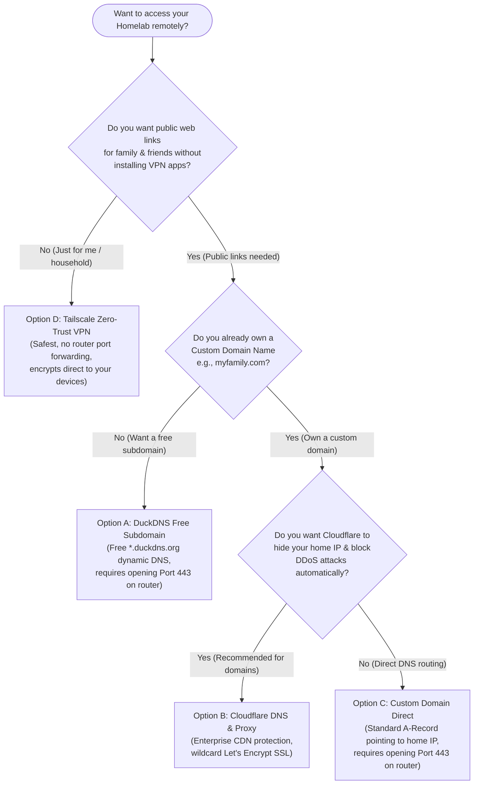

# 05. Networking, DNS & Reverse Proxies

Once your containers are running on your home server, you will want to access their web dashboards from your laptop, smartphone, or tablet—and eventually from outside your house when traveling. But typing ugly IP addresses and port numbers (`http://192.168.1.100:8096`) every time quickly becomes tedious, and exposing raw ports to the internet without encryption is a severe security risk.

In this guide, we will demystify core networking concepts. You will learn what **ports**, **DNS**, and **SSL/TLS padlocks** actually mean, understand how a **reverse proxy** acts as your home traffic controller, and use our decision flowchart to pick the right remote access strategy for your homelab!

---

## 🎯 What You'll Learn

- What **IP addresses** and **ports** are, and why containers bind to numbers like `8096` or `4533`.
- What **DNS (Domain Name System)** is and how it turns friendly names into network addresses.
- What a **reverse proxy** (`Nginx Proxy Manager`) does and why you should never expose raw containers to your router.
- What **SSL/TLS encryption** is and why browsers show green padlock icons.
- How to choose between four core remote access options using our **Mermaid decision flowchart**.

---

## 🚪 What is an IP Address and What is a Port?

Think of an **IP Address** (`192.168.1.100`) like the street address of an apartment building. When network packets travel across your home Wi-Fi or local area network, the IP address ensures the data arrives at the correct physical computer (your home server).

However, an apartment building houses dozens of different apartments inside. If the mail carrier only knows the street address, they don't know *which specific apartment door* to deliver a letter to!

A **Port** is that specific apartment door number. Because your single home server runs multiple distinct services simultaneously, each service listens behind its own unique port number:
- **Jellyfin** listens at door `8096` (`http://192.168.1.100:8096`)
- **Navidrome** listens at door `4533` (`http://192.168.1.100:4533`)
- **Kavita** listens at door `5000` (`http://192.168.1.100:5000`)
- **Nextcloud** listens at door `8080` (`http://192.168.1.100:8080`)

```
┌────────────────────────────────────────────────────────────────────────┐
│ Your Home Server (IP Address: 192.168.1.100)                           │
│                                                                        │
│  ├── Door [Port 8096] ──> Jellyfin Media Server                        │
│  ├── Door [Port 4533] ──> Navidrome Music Server                       │
│  └── Door [Port 5000] ──> Kavita eBook Reader                          │
└────────────────────────────────────────────────────────────────────────┘
```

---

## 🌐 What is DNS (Domain Name System)?

Human beings remember words much better than strings of numbers. **DNS** acts as the digital phonebook of the internet and your home network.

When you type `https://jellyfin.yourdomain.com` into your browser:
1. Your computer asks a DNS server: *"What exact IP address lives behind `jellyfin.yourdomain.com`?"*
2. The DNS server replies: *"That name points to IP address `192.168.1.100`!"*
3. Your browser automatically connects to that IP address.

---

## 🔀 What is a Reverse Proxy?

When you only have one public IP address at home, your home router can only forward incoming web requests (`port 80` for plain HTTP and `port 443` for encrypted HTTPS) to a single computer. How can you serve 10 different web dashboards using nice domain subdomains without forcing users to type custom port numbers?

You use a **Reverse Proxy** (`Nginx Proxy Manager` or `Traefik`).

A reverse proxy acts as the polite front desk receptionist for your home server. It sits right at the entrance of your machine listening exclusively to ports `80` and `443`. When a web request arrives, the receptionist inspects the requested domain name and routes the traffic internally to the correct container door!

```
┌────────────────────────────────────────────────────────────────────────┐
│ How Nginx Proxy Manager (Reverse Proxy) Routes Traffic                 │
│                                                                        │
│  [User Request: https://movies.mydomain.com]                           │
│                        │                                               │
│                        ▼                                               │
│  [Nginx Proxy Manager — Listening on Ports 80 & 443]                   │
│         │                                                              │
│         ├─ If requested domain == movies.mydomain.com  ──> Port 8096   │
│         ├─ If requested domain == music.mydomain.com   ──> Port 4533   │
│         └─ If requested domain == books.mydomain.com   ──> Port 5000   │
└────────────────────────────────────────────────────────────────────────┘
```

> [!NOTE]
> **💡 Why This Matters**
> Using a reverse proxy means **you never have to open raw container ports (`8096`, `4533`, `8080`) to the public internet on your home router.** Only port `443` (encrypted HTTPS) enters your network, where Nginx Proxy Manager securely handles everything.

---

## 🔐 What is SSL/TLS and Why do Browsers Show Padlocks?

If you connect to a web dashboard over plain HTTP (`http://movies.mydomain.com`), every piece of data sent back and forth—including your passwords, session cookies, and private search terms—travels across the network in **cleartext**. Anyone monitoring public Wi-Fi or intermediate routers can read exactly what you type.

**SSL/TLS (Secure Sockets Layer / Transport Layer Security)** wraps your web traffic inside a strong cryptographic tunnel. When encryption is active, your address bar displays `https://` along with a **green padlock icon**.

In our **Homelabbing** architecture, `Nginx Proxy Manager` automatically communicates with **Let's Encrypt**—a free, open digital certificate authority—to provision, install, and renew valid 90-day SSL/TLS certificates for all of your subdomains automatically!

---

## 🗺️ Decision Flowchart: Which Networking Option Should I Choose?

Depending on whether you own a custom domain name, want public access for family members, or only want private access for yourself, our `stacks/networking/` module provides four distinct setup paths.

Use this decision flowchart to pick the best option for your household right now:



---

## 📋 The 4 Networking Options Explained

### Option A: DuckDNS (Free Dynamic DNS)
- **What it does:** Gives you a free subdomain (e.g., `myhomelab.duckdns.org`) and updates automatically whenever your home ISP changes your public IP address.
- **When to choose:** You don't want to purchase a domain name and are comfortable forwarding port `443` on your home router to Nginx Proxy Manager.
- **Trade-offs:** Your public home IP address is visible to anyone querying your DuckDNS domain.

### Option B: Cloudflare DNS & Proxy (Recommended for Custom Domains)
- **What it does:** Routes your custom domain (`*.mydomain.com`) through Cloudflare's global edge network before traffic hits your home server.
- **When to choose:** You own a domain name and want professional DDoS protection while keeping your home IP address completely hidden from the public web.
- **Trade-offs:** Requires purchasing a domain (~$10/year) and setting your nameservers to Cloudflare.

### Option C: Custom Domain Direct Routing
- **What it does:** Points your custom domain (`*.mydomain.com`) directly to your home public IP via standard DNS A-records, using Nginx Proxy Manager to terminate HTTPS.
- **When to choose:** You own a domain but prefer not to route traffic through Cloudflare's proxy network.
- **Trade-offs:** Exposes your home public IP address and requires forwarding port `443` on your router.

### Option D: Tailscale Zero-Trust VPN (The Safest Choice)
- **What it does:** Installs a secure WireGuard mesh VPN on your server, laptop, and phone. Your server stays entirely hidden from the public internet.
- **When to choose:** You only need access for yourself or close household members who can install the Tailscale app on their devices.
- **Trade-offs:** Requires installing the lightweight Tailscale client on any phone or computer that wants to connect to the lab.

---

## 🔍 What Just Happened?

By mastering these concepts:
1. You understand why containers bind to internal ports and why reverse proxies (`Nginx Proxy Manager`) listen on ports `80` and `443` to direct traffic cleanly.
2. You know why SSL/TLS encryption (`Let's Encrypt`) is mandatory to protect passwords across the internet.
3. You used our decision flowchart to select the exact networking stack path (`Option A`, `B`, `C`, or `D`) inside our modular `stacks/networking/` directory!

---

## 🧩 What's Next?

Now that your networking concepts and routing pathways are clear, how do you make sure your irreplaceable configurations, family photos, and database vaults survive if a hard drive dies or an update goes wrong?

👉 **Proceed to [06. Backups & Data Redundancy](06-backups-and-redundancy.md)**
